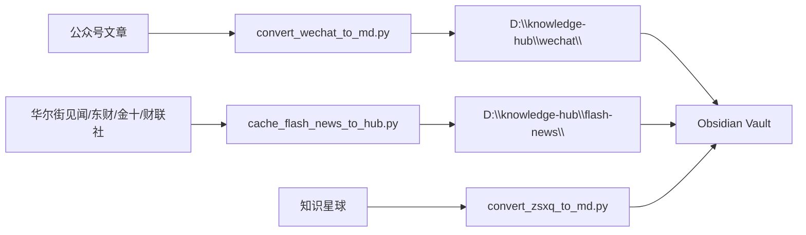

# 知识库捕获管道实验日志

**创建**: 2026-06-25
**定位**: 知识星球/IMA知识库 → mitmproxy捕获 → Obsidian Markdown 全链路实验记录
**对应工具**: `tools/ima_capture.py`, `tools/convert_zsxq_to_md.py`

---

## 实验 #1 — 知识星球完整捕获管道搭建 (2026-06-25)

### 背景
用户需要将知识星球付费群（Geek投资群，group_id: 28888114545551）的全部话题离线保存到 Obsidian 知识库。内容为券商研报摘要/投资分析，时间跨度 2026-01 至 2026-06，约 35,000+ 条话题 + 1,000+ 张图片。

核心约束：
- 知识星球没有官方下载/导出 API
- API 请求需要 HMAC 签名（x-signature），无法直接从 CLI 调用
- 只能通过浏览器交互 + mitmproxy 拦截

### 架构

```
浏览器操作 ↔ wx.zsxq.com (SPA)
                ↕ HTTPS
         mitmdump -s ima_capture.py
                ↕
     D:\ima_captures\{YYYYMMDD}\zsxq\{group_id}\
        _topics/    ← JSON API 响应（按 cursor 分文件）
        _images/    ← 图片文件
                ↕
     convert_zsxq_to_md.py
                ↕
     D:\knowledge-hub\zsxq\{group_id}\{YYYY-MM-DD}\
        topic_{topic_id}.md  ← Obsidian Markdown
        _images/             ← 图片引用
```

### 设计决策

| 决策 | 选择 | 理由 |
|------|------|------|
| 捕获方式 | mitmproxy 中间人代理 | 应用无 API，HTTPS 拦截是最可靠的数据获取方式 |
| 去重策略 | topic_id 持久化 (state.json) | 代理重启/崩溃后不重复捕获，批量保存防丢 |
| 图片归属 | API 请求上下文 + Referer 双重推断 | 图片请求不含群组 ID，需从同期 API 调用或 Referer 推导 |
| 输出格式 | Obsidian Markdown (frontmatter + 正文 + ![]图片链接) | 用户使用 Obsidian 管理知识库，需要图片引用而非嵌入 |
| 日期目录 | 按 create_time 分 YYYY-MM-DD 子目录 | 时间线浏览，与 Obsidian 日历插件兼容 |
| 认证保存 | 首次 API 请求自动保存 Cookie + Headers | 预留后续批量拉取能力 |

### ima_capture.py 关键实现

**URL 路由逻辑**：
```
response(flow)
  ├── zsxq.com  → _handle_zsxq()
  │   ├── api.zsxq.com/topics → JSON 保存（按 topic_id 去重）
  │   └── images.zsxq.com     → 图片保存（按 Referer 推断群组）
  └── 其他图片   → _handle_ima() (IMA 知识库)
```

**去重持久化**：
```python
# 每次保存后写盘，mitmproxy 退出时再写一次
_save_state()  # 每批 API 响应保存后调用
done() → _save_state()  # 进程退出时
```

**图片去噪**：跳过 emoji/图标/贴纸（路径为纯数字且长度 <5）

### 运行结果（第一波捕获）

| 指标 | 数值 |
|------|------|
| 唯一 topic_id | 35,544 |
| 生成 Markdown 文件 | 47,245 篇 |
| 图片 | 1,177 张 |
| 捕获耗时 | ~4 小时（含用户手动月份切换 + 自动滚动）|
| 转换耗时 | ~30 秒 |
| 覆盖时间段 | 2026-01-01 至 2026-06-25 |

### 运行结果（第二波补充捕获 2026-06-25）

用户后续通过 mitmproxy 补充捕获 2025-07 至 2026-01 共 7 个月数据（含部分 2026-02~06 的增量话题），总库从 47,245 篇扩展至 **90,947 篇**。

| 指标 | 数值 |
|------|------|
| 最终 Markdown 文件 | 90,947 篇 |
| 图片 | 9,846 张 |
| 覆盖时间段 | 2025-06-01 至 2026-06-25（完整 12+ 个月）|
| 输出路径 | D:\knowledge-hub\zsxq\28888114545551\ |

### 用户交互流程

1. 启动 mitmdump: `mitmdump -s tools/ima_capture.py -p 8888`
2. 打开系统代理（端口 8888）
3. 浏览器中打开 wx.zsxq.com，登录
4. 右侧月份选择器切换到目标月份
5. 鼠标中键自动滚动（SPA 懒加载触发 API 翻页）
6. 每月份加载完后切换下一个月
7. 关闭代理 → 运行转换脚本

### 已知问题

- IMA 知识库 CDN URL 正则 `_extract_kb_id()` 未匹配实际 URL，图片落入 `other/`（未修复，非当前优先级）
- 图片去重依赖 URL 去重而非内容哈希，可能漏掉同图不同 URL 的重复

### 待处理

- ☐ 知识库其他版块（九点特供/红宝书/盘中宝/电报解读）独立浏览捕获
- ☐ IMA CDN URL 模式修正
- ☐ SAG 动态图谱构建（47k 话题的内容索引）

---

## 实验 #2 — mitmproxy 第一性原则文档化 (2026-06-25)

### 背景
用户多次遇到"数据拿不到"的问题（IMA API 403、公众号无反爬绕过、知识星球无 API），最终 mitmproxy 全部解决。这是一个反复出现的模式：**当应用无 API 时，中间人代理拦截网络流量是第一性原理解决方案**。

### 文档化
新建 `memory/reference-mitmproxy-first.md`，收录：
- 问题模式识别：应用有 GUI 但无下载/导出功能
- 三要素：系统证书信任 / HTTP(S) 代理配置 / 路由逻辑
- 难点排查清单：非标准端口、非 HTTP(S)、SSL pinning、Electron CSP
- IMA 知识库 / 知识星球 / 微信文章 三类场景的捕获架构示意图

---

## 实验 #3 — 代理工作流确认与运营知识 (2026-06-26)

### 背景
用户日常需要在两个互斥场景间切换：① 刷知识星球/IMA 抓数据（需代理 ON）② 跑日报流水线 / 访问 GitHub Pages（需代理 OFF）。两者不能同时进行。

### 核心运营规则

| 场景 | 代理 | mitmdump | 说明 |
|------|------|----------|------|
| 刷知识星球/IMA | ON | 运行中 | 走 127.0.0.1:8888，ima_capture.py 拦截 zsxq.com + image.myqcloud.com |
| 跑 update_sources.bat | OFF | 关闭 | 需要 git push 到 GitHub + Claude Code 联网搜索 |
| 浏览 GitHub Pages | OFF | 关闭 | GitHub 的标准 HTTPS 被 mitmdump 拦截会超时 |
| 刷抖音等 | 不敏感 | - | QUIC/HTTP3 绕过系统代理，不受影响 |

### 关键发现
- **IMA 桌面应用走系统代理**: Electron 应用标准 Chromium 网络栈，ProxyEnable=1 时正常路由
- **代理设置要点**: 改完地址/端口后必须点「保存」，否则 ProxyEnable 仍为 0
- **Windows 代理持久化**: 设置存注册表，关机不自动清除。下次开机代理 ON 但 mitmdump 未运行 → 断网
- **HTTPS 证书**: mitmproxy CA 已安装到系统受信任根证书颁发机构（`~/.mitmproxy/mitmproxy-ca-cert.cer`）

### 日常操作流程
```
开代理 → 刷知识星球/IMA → 关代理 → 跑 update_sources.bat
```

### 推荐工具
桌面已建 `开启抓包.bat` / `关闭抓包.bat`，但由于 Windows 安全策略被拦截。改用 PowerShell 命令：
```powershell
start mitmdump -s tools/ima_capture.py -p 8888   # 开启
taskkill /f /im mitmdump.exe                       # 关闭
```
代理设置需手动到 Windows 设置中开关。

---

## 实验 #4 — 公众号 + 快讯 入库 Obsidian 扩展 (2026-06-26)

### 背景
用户要求将所有信源数据统一保存到 Obsidian 知识库。此前只有知识星球通过 `convert_zsxq_to_md.py` 入库，公众号文章（txt 散落在 `wechat_articles/`）和每日快讯（华尔街见闻/东财/金十/财联社，用完即弃）都不在知识库中。

### 新增管道



### 新建文件

| 文件 | 功能 | 设计 |
|------|------|------|
| `tools/convert_wechat_to_md.py` | 公众号 txt → Obsidian markdown | YAML frontmatter (source/account/category/title/url/article_time/captured_at) + 正文。按 `账号/日期/` 组织目录。幂等。 |
| `tools/cache_flash_news_to_hub.py` | 快讯 _headlines → markdown | 每天一个文件，按来源分组。时间戳统一为 HH:MM。 |

### 管道集成

- `_fetch_articles.py`：每次成功保存 txt → 同步写 markdown 到 knowledge-hub
- `shock_detector.py`：每次运行保存结果 → 调用 cache_flash_news_md()

### 输出规模

| 数据源 | 文件数 | 位置 |
|--------|--------|------|
| 公众号 | 10,769 篇 | `D:\knowledge-hub\wechat\14个号\` |
| 快讯 | 每日 ~600 条 | `D:\knowledge-hub\flash-news\YYYY-MM-DD.md` |

### 设计决策

- 快讯采用每日单文件（非每条一文件），因为每条仅 1-2 句，散文件在 Obsidian 中不可浏览
- 时间戳归一化：兼容华尔街见闻 Unix 时间戳和东财 datetime 字符串
- 图片引用路径沿用知识星球惯例：`../_images/{filename}`
- 幂等守卫：目标文件已存在则跳过，支持增量重复运行

### 关键词
#知识库 #Obsidian #数据管道 #公众号 #快讯 #capture-pipeline #实验#4
